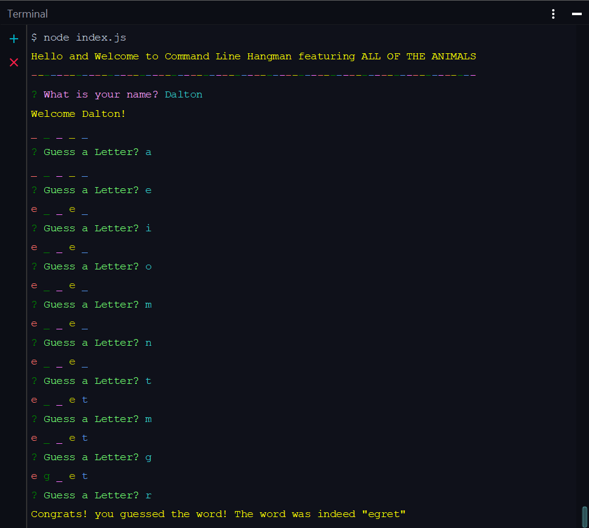

# Constructor-Word-Guess
##### Homework 11 - Optional Advanced JavaScript Assignment

This is a Hangman game that runs in the command line using Node.js, programmed using constructor functions, because... who doesn't love a good Constructor.  They are even better when I don't manage to break them.  I used a very large word bank that I had written up for a previous assignment including quite a lot of various animals.  Namely all of the national animals for the countries in the world, and then a few more random ones I added in... because pangolins are amazing and you have to include a labradoodle...

There is a second version of the game which uses the 'prompt' npm module in places for the queries, which allowed me to restrict the character inputs to just letters, or a space (which is used to exit the game).  Rather that using the word bank that I had previously generated this one uses the 'random-words' npm module to provide a random word for the game.


## Getting Started

These instructions will get you a copy of the project up and running on your local machine for development and testing purposes.

### Prerequisites

In order to install and run this wonderful waste of time you simply need node.js.  To view or edit the files a text/code editor such as Visual Studio Code or WebStorm is recommended.

```
node.js
```

### Installing

You will need to do the following steps after cloning the repo to your device in order to ensure that it works properly.

To ensure Node.js is running within the package and configure all modules for use:

```
npm install
```

This should install all the requisite modules, but just in case, the only one currently necessary is:

```
inquirer
prompt
colors
random-words
```
## Running The Game

The Constructor-Word-Guess game is initialized from the command line via:

```
node index.js
```

And the alternate version using the random-words module and prompt are intialized via:

```
node prompt.js
```

And it will prompt you via inquirer for your name and then simply ask for you to guess letters for the word.




## Built With

* [Node.js](https://nodejs.org/en/) - Runtime Environment
* [gitignore.io](https://www.gitignore.io/) - For creating the .gitignore
* [Screencastify](https://www.screencastify.com/) - For screenshots/video in the README.md
* [WebStorm](https://www.jetbrains.com/webstorm/) - IDE

## Authors

* **Dalton Ricker** - *Primary Author* - [SasquatchXYZ](https://github.com/SasquatchXYZ)

## Acknowledgments
* Many thanks to my instructors & TAs, as well as the O'Reilly reference books.